# 🌌 GitHub Contribution Galaxy

[](https://github.com/nithin1024/Youtube_Ad_Remover/actions/workflows/galaxy.yml)
[](LICENSE)
[](https://www.python.org/downloads/)

An automated, production-quality project that transforms your GitHub contribution history into a stunning, interactive, animated visual **Contribution Galaxy SVG** designed for your GitHub Profile README.

---

## 🌌 What is this?

**GitHub Contribution Galaxy** converts your 365-day contribution calendar into a cosmic galaxy visualization. Instead of a standard 2D grid heatmap, your daily contributions become glowing celestial objects embedded within spiral galaxy arms.

```
    ✦           ·
          ✦
·                  ✦

         🪐

   ✦          ⭐
             ·
      🌍

 ✦              ·
```

---

## 📸 Demo & Preview

### Generated SVG Preview


---

## ✨ Features

- 🌌 **Spiral Galaxy Mapping**: Deterministic double-arm spiral polar coordinate mapping for 365 days of activity.
- 🎨 **8-Layer Visual Engine**: Deep space radial background, multi-color glowing nebulae, ambient stars, daily contribution stars, streak constellations, milestone planets, stat card grid, and achievement badges.
- 📊 **365-Day Contribution Analytics**: Computes total contributions, active days, average activity per day, most active day/month, and intensity distribution.
- ☄️ **Streak Constellations**: Detects continuous contribution streaks $\ge 5$ days and renders glowing SVG paths connecting daily stars with badge labels.
- 🏆 **Achievement System**: Built-in engine evaluating 11 unique achievement badges (e.g. *7/30/100 Day Streaks*, *Night Coder*, *Consistent Coder*, *Galaxy Explorer*).
- 🎮 **Gamification (XP & Leveling)**: Dynamic XP calculation based on contributions, streaks, and achievements with title tiers (*Starlight Novice* to *Celestial Legend*).
- ⚡ **Responsive Animated SVG**: Modern SVG using `viewBox` scale rendering with subtle CSS keyframe animations (twinkling stars, glowing nebulae, orbiting planets).
- 🌐 **Interactive Web Preview**: Local glassmorphism web dashboard (`web/index.html`) displaying live stats and achievement cards.
- 🤖 **Zero-Maintenance GitHub Actions**: Runs on a daily cron schedule to keep your profile galaxy updated automatically.

---

## 🏗️ Architecture & How It Works

```
┌─────────────────────────┐
│  GitHub GraphQL API     │
└────────────┬────────────┘
             │ (365-day Calendar)
             ▼
┌─────────────────────────┐
│ Contribution Analyzer   │ ──► Compute Total, Active Days, Averages
└────────────┬────────────┘
             ▼
┌─────────────────────────┐
│    Streak Analyzer      │ ──► Compute Streaks & Constellation Coordinates
└────────────┬────────────┘
             ▼
┌─────────────────────────┐
│ Achievement & Level Sys │ ──► Compute XP, Level Progress, Achievements
└────────────┬────────────┘
             ▼
┌─────────────────────────┐
│  SVG Galaxy Generator   │ ──► Render 8 Visual Layers to SVG
└────────────┬────────────┘
             ├──────────────────────────┐
             ▼                          ▼
    output/galaxy.svg            output/stats.json
             │                          │
             ▼                          ▼
    GitHub Profile README       Local Web Dashboard
```

---

## 🛠️ Tech Stack

- **Core Engine**: Python 3.11+
- **Graphics**: Scalable Vector Graphics (SVG) + CSS Animations
- **Web UI**: HTML5, Vanilla CSS3 (Glassmorphism), JavaScript (ES6)
- **API**: GitHub GraphQL API (`v4`)
- **Automation**: GitHub Actions (Cron & `workflow_dispatch`)
- **Testing**: `pytest`

---

## 📁 Project Structure

```
github-contribution-galaxy/
├── .github/
│   └── workflows/
│       └── galaxy.yml         # GitHub Actions daily schedule
├── src/
│   ├── __init__.py            # Package init
│   ├── config.py              # Configuration manager
│   ├── github_client.py       # GraphQL API client with mock fallback
│   ├── contribution_analyzer.py # 365-day analytics engine
│   ├── streak_analyzer.py     # Streak detector & constellation generator
│   ├── achievements.py        # Achievement engine
│   ├── level_system.py        # XP & Level math engine
│   ├── svg_components.py      # SVG layer renders & CSS keyframes
│   └── galaxy_generator.py    # Master SVG & stats output builder
├── web/
│   ├── index.html             # Dashboard preview layout
│   ├── style.css              # Glassmorphism dark space theme
│   └── app.js                 # Dynamic fetch & dashboard renderer
├── output/
│   ├── galaxy.svg             # Rendered vector galaxy SVG
│   └── stats.json             # Metric & achievement JSON export
├── tests/
│   ├── test_contributions.py  # Contribution unit tests
│   ├── test_streaks.py        # Streak unit tests
│   ├── test_achievements.py   # Achievement unit tests
│   ├── test_levels.py         # Leveling unit tests
│   └── test_galaxy.py         # SVG & File generation unit tests
├── .env.example               # Environment template
├── .gitignore                 # Git rules
├── config.json                # Visual & game configuration
├── generate.py                # Main CLI entry point
├── requirements.txt           # Project dependencies
├── README.md                  # Documentation
└── LICENSE                    # MIT License
```

---

## 💻 Local Setup & Execution (Windows / macOS / Linux)

### 1. Clone the Repository
```bash
git clone https://github.com/nithin1024/Youtube_Ad_Remover.git
cd Youtube_Ad_Remover
```

### 2. Create Virtual Environment
```powershell
# Windows PowerShell
python -m venv .venv
.\.venv\Scripts\Activate.ps1

# Linux / macOS
python3 -m venv .venv
source .venv/bin/activate
```

### 3. Install Dependencies
```bash
pip install -r requirements.txt
```

### 4. Configure Environment Variables
Copy `.env.example` to `.env`:
```powershell
copy .env.example .env
```
Edit `.env` and fill in your credentials:
```env
GITHUB_TOKEN=your_personal_access_token_here
GITHUB_USERNAME=your_github_username_here
```

### 5. Run the Generator
```bash
# Run with GitHub API credentials
python generate.py

# Or run in offline Mock Mode (no token required)
python generate.py --mock --username demo-user
```

### 6. View Local Web Preview
Open `web/index.html` in any browser, or use Python's built-in HTTP server:
```bash
python -m http.server 8000
```
Then navigate to: `http://localhost:8000/web/`

---

## 🔑 GitHub Token Setup

To allow the generator to fetch your private/public GitHub contribution history:

1. Visit [GitHub Token Settings](https://github.com/settings/tokens).
2. Click **Generate new token (classic)**.
3. Give it a name (e.g. `Contribution Galaxy`).
4. Select the `read:user` scope (and `repo` scope if you want private repository contributions included).
5. Click **Generate token** and copy the resulting string.

> [!WARNING]
> Never commit your `.env` file or hardcode your token into code repositories!

---

## 🤖 GitHub Actions Setup (Automated Profile README Update)

To set up automated updates on your repository:

1. Push this project to your GitHub repository.
2. Go to **Settings > Secrets and variables > Actions** in your repository.
3. Click **New repository secret**.
4. Add `GITHUB_TOKEN` (or use GitHub Action's built-in `${{ secrets.GITHUB_TOKEN }}`).
5. Under **Settings > Actions > General > Workflow permissions**, grant **Read and write permissions**.
6. The workflow will now trigger automatically at midnight UTC everyday!

### Manual Triggering
To manually run the workflow at any time:
1. Navigate to the **Actions** tab on GitHub.
2. Select **GitHub Contribution Galaxy Workflow**.
3. Click **Run workflow** -> **Run workflow**.

---

## 🖼️ GitHub Profile README Integration

Add the following snippet to your GitHub Profile `README.md`:

```markdown
## 🌌 My Contribution Galaxy


```

Or reference it directly from your repository's raw URL:

```markdown

```

---

## ⚙️ Configuration & Customization (`config.json`)

You can easily customize galaxy titles, dimensions, themes, and XP multipliers in `config.json`:

```json
{
  "galaxy_title": "MY COSMIC CONTRIBUTIONS",
  "svg_dimensions": {
    "width": 850,
    "height": 880
  },
  "animation_enabled": true,
  "xp_multiplier": 10,
  "theme": {
    "bg_start": "#080a14",
    "bg_end": "#030408",
    "nebula_cyan": "#00f0ff",
    "nebula_purple": "#7000ff",
    "nebula_pink": "#ff007b"
  }
}
```

---

## 🧪 Testing Suite

Run the full pytest suite:

```bash
pytest tests/ -v
```

---

## ❓ Troubleshooting

| Issue | Cause | Solution |
| :--- | :--- | :--- |
| `401 Unauthorized` | Invalid `GITHUB_TOKEN` | Verify token in `.env` or GitHub Secrets. |
| `User not found` | Incorrect `GITHUB_USERNAME` | Check username spelling in configuration. |
| Workflow doesn't push | Insufficient workflow permissions | Enable **Read and write permissions** in Repository Settings > Actions. |
| SVG looks static | Client browser disables SVG CSS keyframes | The visual fallback design remains crisp and readable. |

---

## 🔒 Security

- `GITHUB_TOKEN` is never stored in generated SVG files, JSON logs, or git commits.
- `.env` is explicitly listed in `.gitignore`.
- GraphQL requests utilize TLS encryption over HTTPS.

---

## 🔮 Future Improvements

- [ ] 3D Interactive Three.js Web Canvas export.
- [ ] Multi-year galaxy cluster view.
- [ ] Audio cosmic ambient sound effect toggles in Web UI.

---

## 📜 License

This project is released under the [MIT License](LICENSE).
